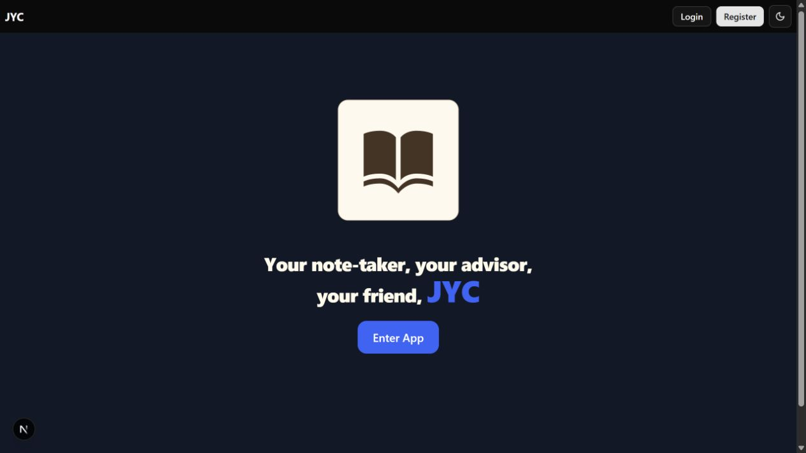
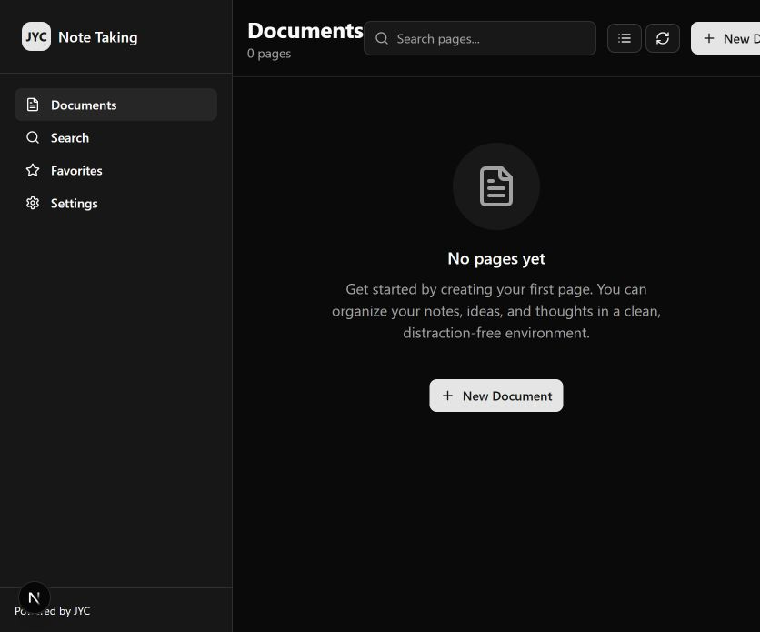
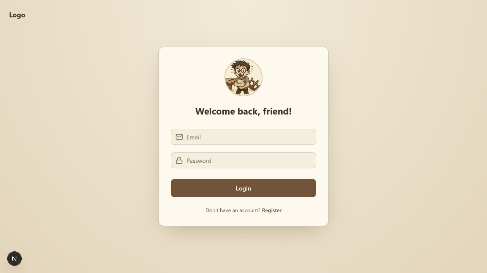
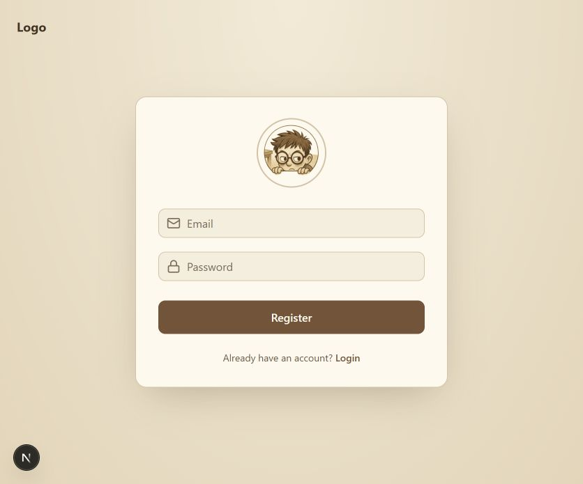

# JYC

**A clean, personal workspace for your notes and ideas.**

JYC is a full-stack note-taking project with a focused document dashboard that makes creating and finding pages simple.

## Why JYC?

- **Start in seconds:** create a titled page directly from the dashboard.
- **Find pages fast:** search your page titles as you type.
- **Choose your view:** switch between a visual grid and a compact list.
- **Make it comfortable:** choose light, dark, or system theme settings.
- **Keep your workspace connected:** account registration and login connect to a Spring Boot API, with pages persisted in PostgreSQL.

Built with **Next.js, React, TypeScript, and Tailwind CSS**, backed by **Java 21, Spring Boot, Spring Security, and PostgreSQL**.

*Currently in development: page creation and browsing are implemented; opening a page in a note editor is still to come.*

## Preview

Screenshots of the local development version, captured September 10, 2026.

### Homepage

### Documents dashboard

### Login

### Registration

